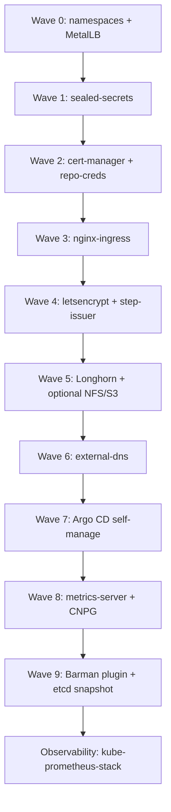
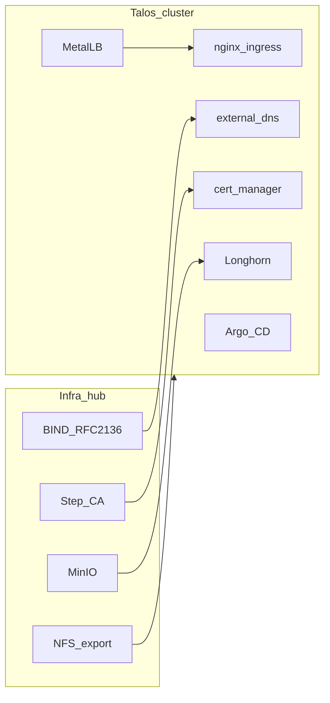

# Architecture

## Sync waves

Argo CD applies Applications in numeric wave order. Lower waves must be healthy enough for later waves to exist (namespaces, LoadBalancer IPs, cert-manager CRDs, storage classes).

`kube-prometheus-stack` is wave **10** in some long-lived labs because it is “an app.” This starter treats it as part of the platform. See [observability](observability.md).

## Cluster vs Unraid (or any NAS)

The hub can be Unraid, TrueNAS, or a spare VM. The cluster does not install BIND or MinIO for you.

## Why these choices

| Choice | Why | Alternative |
|--------|-----|-------------|
| App of Apps | Each app is a file you can delete or ignoreDifferences | ApplicationSet (better when you have dozens of identical apps) |
| F5 nginx-ingress chart | The kubernetes/ingress-nginx project is not the path we want to start people on | Traefik, Cilium Gateway |
| SealedSecrets | Secrets stay in Git, bound to one cluster | SOPS + age, External Secrets |
| MetalLB L2 | Homelab LAN, no BGP required | kube-vip, Cilium L2 announcements |
| Longhorn | Block RWO on node disks; works on Talos with extensions | local-path (no replica), rook-ceph (heavier) |
| Flannel (Talos default) | Ships with Talos; **does not enforce NetworkPolicy** | Cilium if you want policy |

## Pod Security

Talos enforces Pod Security Admission. MetalLB speakers, Longhorn, NFS provisioner, and kube-prometheus-stack components need **privileged** namespaces. Wave 0 labels those namespaces `enforce=privileged`. App namespaces get `warn` + `audit` `restricted` only — do not `enforce=restricted` until you have watched warnings.
