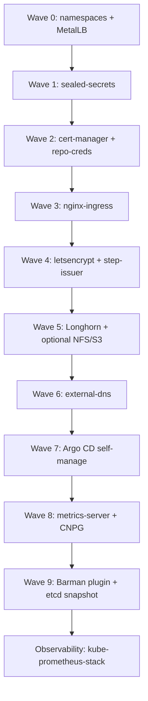
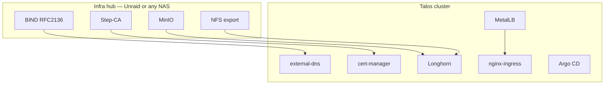
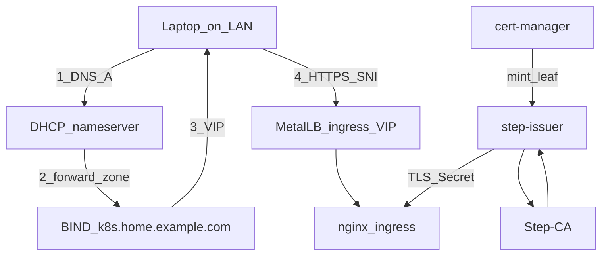

# Architecture

## Sync waves

Argo CD applies Applications in numeric wave order. Lower waves must be healthy enough for later waves to exist (namespaces, LoadBalancer IPs, cert-manager CRDs, storage classes).

`kube-prometheus-stack` is wave **10** in some long-lived labs because it is “an app.” This starter treats it as part of the platform. See [observability](observability.md).

## Cluster vs Unraid (or any NAS)

The hub can be Unraid, TrueNAS, or a spare VM. The cluster does not install BIND or MinIO for you.

## How a LAN request is routed

This is the path that [DNS](dns.md) and [Step-CA](step-ca.md) exist for. Nothing in Kubernetes replaces either hop.

1. The laptop asks whatever DHCP gave it (router, Pi-hole). That resolver must **forward** `k8s.home.example.com` to BIND, or BIND must *be* the resolver.
2. BIND returns the ingress VIP (`10.0.0.30` in the examples — a reserved MetalLB VIP, not a node IP and not the API VIP). See [addressing](addressing.md).
3. The browser connects to that VIP with SNI `grafana.k8s.home.example.com`.
4. nginx presents a leaf cert minted by Step-CA. The laptop must trust the **root**, not the leaf.

Public names skip BIND and Step-CA: public DNS + Let's Encrypt HTTP-01 on port 80 of the same VIP. The router/firewall WAN forward for 80/443 must target that **ingress VIP**, not a node and not the API VIP.

## Why these choices

| Choice | Why | Alternative |
|--------|-----|-------------|
| App of Apps | Each app is a file you can delete or ignoreDifferences | ApplicationSet (better when you have dozens of identical apps) |
| F5 nginx-ingress chart | The kubernetes/ingress-nginx project is not the path we want to start people on | Traefik, Cilium Gateway |
| SealedSecrets | Secrets stay in Git, bound to one cluster | SOPS + age, External Secrets |
| Talos API VIP + MetalLB L2 | One kubeconfig IP; app LBs without BGP | kube-vip for everything, Cilium L2 |
| Longhorn default, NFS for RWX, S3 for backups | Block IO on workers; NAS share when many pods need one tree; object API for archives. See [storage](waves/5-storage.md) | local-path (no replica), rook-ceph (heavier), csi-s3 as a fake disk |
| [Flannel](https://github.com/flannel-io/flannel) (Talos default) | Ships with Talos; **does not enforce NetworkPolicy** | Cilium if you want policy |

## Pod Security

Talos enforces Pod Security Admission. MetalLB speakers, Longhorn, NFS provisioner, and kube-prometheus-stack components need **privileged** namespaces. Wave 0 labels those namespaces `enforce=privileged`. App namespaces get `warn` + `audit` `restricted` only — do not `enforce=restricted` until you have watched warnings.
