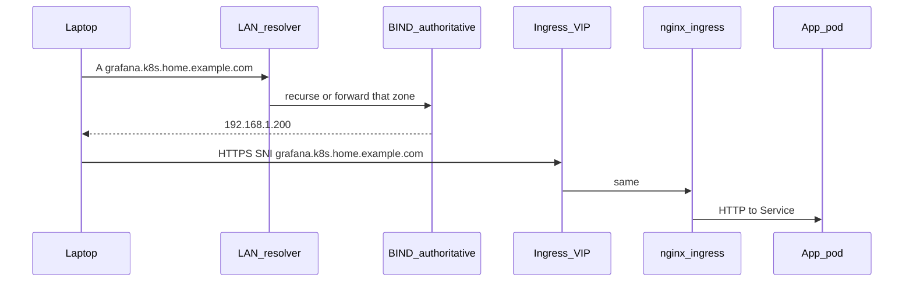

# Local DNS and routing

This page is the LAN story: how `grafana.k8s.home.example.com` becomes the ingress VIP on your network, who is allowed to create that record, and how that differs from a public name that Let's Encrypt can see.

Wave 6 only installs [external-dns](https://kubernetes-sigs.github.io/external-dns/). It cannot replace a nameserver. If clients cannot resolve the zone **before** the cluster exists, they will not resolve it after either.

## What “local routing” means here

A browser on the LAN does **not** talk to a Kubernetes Service name (`grafana.monitoring.svc`). It talks to a **DNS name you chose**, which must resolve to a **LAN IP** that MetalLB gave the ingress controller (or another LoadBalancer).



TLS is a separate problem. The certificate on that handshake is issued by [Step-CA](step-ca.md) for internal names, or Let's Encrypt for public names. DNS only has to land the packet on the VIP.

## Name plan (do this first)

Pick **one internal zone** that will never need to resolve on the public internet:

| Piece | Example | Who owns the records |
|-------|---------|----------------------|
| LAN / house zone (optional) | `home.example.com` | You, statically: `unraid.home.example.com`, `router.home.example.com` |
| Cluster zone | `k8s.home.example.com` | **external-dns** (dynamic A/TXT) |
| Public zone (optional) | `k8s.example.com` or `example.com` | Public DNS (Cloudflare, registrar) + Let's Encrypt |

App hostnames then look like:

- Internal UI: `grafana.k8s.home.example.com`
- Public app: `app.k8s.example.com`

Do **not** put Grafana on a public name unless you mean it. Internal names never get a Let's Encrypt cert via HTTP-01, because Let's Encrypt's validators are not on your LAN.

A wildcard `*.k8s.home.example.com → <ingress VIP>` is a valid **fallback** if you skip external-dns. Per-host records are better once automation works: you can see what is live, and you can point a single Service (non-HTTP) at a different VIP.

## Two resolver topologies

BIND (or Knot, PowerDNS, Windows DNS — anything that speaks **RFC2136 + TSIG**) must be **authoritative** for `k8s.home.example.com`. Something else on the LAN must **ask** that server when a client looks the name up.

### A — Authoritative-only BIND (typical with OPNsense / Unifi / a router)

```text
Laptop DHCP DNS ──► router or Pi-hole (recursive)
                         │
                         │ stub / domain override:
                         │   k8s.home.example.com → 192.168.1.2
                         ▼
                    BIND on Unraid :53
                    (authoritative only, recursion no)
```

- DHCP still hands out the router (or Pi-hole) as the only resolver. You do not change every client.
- You **must** add a domain override / stub / forwarder on that resolver for `k8s.home.example.com` (and `home.example.com` if you use it).
- OPNsense: **Services → Unbound → Overrides → Domain** (or a forwarding zone) pointing at the BIND IP.
- Pi-hole v6 / dnsmasq: `server=/k8s.home.example.com/192.168.1.2`
- Unifi: local DNS record is per-host; a full zone usually means you run BIND anyway and forward from the gateway.

### B — BIND is the LAN resolver

```text
Laptop DHCP DNS ──► BIND on Unraid :53
                    recursion yes
                    also master for k8s.home.example.com
```

- Simpler BIND config, one box to debug.
- If Unraid is down, **the whole LAN loses DNS** unless you add a second resolver. Fine for a lab; bad if Unraid reboots often.
- Point Talos `machine.network.nameservers` at this IP (and maybe the router as a second).

This starter assumes **A** unless you say otherwise: Unraid already runs other infra, the router stays the DHCP DNS, and BIND only answers for the cluster zone.

## BIND on Unraid (authoritative + RFC2136)

You can use the official ISC image, a community Unraid template, or BIND on a small VM. The config below is the part that matters.

### 1. TSIG key

On a workstation with `tsig-keygen` (bind package) or `ldns-keygen`:

```bash
tsig-keygen -a hmac-sha256 externaldns-key
```

You get something like:

```text
key "externaldns-key" {
    algorithm hmac-sha256;
    secret "base64-bytes-here";
};
```

The **secret** is what you later `kubeseal` into `external-dns` as Secret `tsig` key `secret`. The **key name** must match `--rfc2136-tsig-keyname`.

### 2. `named.conf` (shape)

```text
options {
    directory "/var/cache/bind";
    listen-on { 192.168.1.2; };
    listen-on-v6 { none; };
    allow-query { 192.168.1.0/24; };
    recursion no;                 // topology A
    dnssec-validation no;         // lab; enable later if you want
};

include "/etc/bind/externaldns-key.conf";

zone "k8s.home.example.com" {
    type master;
    file "/var/lib/bind/k8s.home.example.com.zone";
    allow-transfer { key "externaldns-key"; };
    update-policy {
        grant externaldns-key zonesub ANY;
    };
};
```

`update-policy grant … zonesub ANY` lets that TSIG key create/delete **any** record under the zone (A, TXT, and the `external-dns-` TXT ownership records). That is what external-dns needs.

`allow-update { key "externaldns-key"; };` also works. Do **not** `allow-update { 192.168.1.0/24; }` without TSIG on a homelab you do not fully trust.

### 3. Zone file

```text
$ORIGIN k8s.home.example.com.
$TTL 60
@   IN SOA ns.home.example.com. hostmaster.example.com. (
        1 3600 600 86400 60 )
    IN NS  ns.home.example.com.

; optional static pin so ingress works before the first external-dns run
*.k8s.home.example.com.  IN A  192.168.1.200
```

TTL 60 keeps a bad record from sticking. The SOA serial is ignored for dynamic updates; BIND rewrites the file.

`ns.home.example.com` should exist in the parent zone (static A to the BIND IP) if anything walks NS records. Many LAN resolvers never will.

### 4. What external-dns actually writes

For Ingress host `grafana.k8s.home.example.com` whose Service is a LoadBalancer at `192.168.1.200`:

| Record | Purpose |
|--------|---------|
| `grafana.k8s.home.example.com A 192.168.1.200` | The lookup clients use |
| `external-dns-grafana.k8s.home.example.com TXT "heritage=external-dns,external-dns/owner=k8s,…"` | Ownership so two clusters do not fight |

`--txt-prefix=external-dns-` and `--txt-owner-id=k8s` in this repo must stay unique if you ever run a second cluster against the same zone.

`--domain-filter` **and** `--rfc2136-zone` must be the same zone you created. A filter of `home.example.com` with a zone of `k8s.home.example.com` will skip names or fail updates.

### 5. Who BIND sees (source IP)

Pods do not usually source from the pod CIDR on the way to Unraid. kube-proxy / CNI masquerades to a **node IP**. Allowing “the cluster nodes” is enough if you also require TSIG.

If updates fail with `REFUSED` or `NOTAUTH`, check BIND logs for the **source IP** and whether the TSIG name matched. Clock skew of more than a few minutes breaks HMAC.

Seal the key **after** wave 1 (see [secrets](secrets.md)). The Deployment in `values/external-dns/deployment.yaml` will CrashLoop until Secret `tsig` exists.

## Router / Unbound override (topology A)

Example: Unbound on OPNsense, BIND at `192.168.1.2`.

- **Domain override:** domain `k8s.home.example.com`, IP `192.168.1.2`.
- Do the same for `home.example.com` if BIND (or Unraid) is authoritative for the parent too.

Test from a **laptop**, not only from a node:

```bash
# Does the LAN resolver know where the zone lives?
dig grafana.k8s.home.example.com @192.168.1.1

# Does BIND itself answer?
dig grafana.k8s.home.example.com @192.168.1.2 +norecurse

# After external-dns (or the wildcard) exists:
dig +short grafana.k8s.home.example.com
# expect the ingress VIP, e.g. 192.168.1.200
```

If `@192.168.1.2` works and `@192.168.1.1` does not, the override is wrong. If both fail, the zone or record is wrong.

Talos nodes need the same path: `machine.network.nameservers` should be the **LAN resolver** (router / Pi-hole), not `8.8.8.8` only. Cluster pods that look up `*.k8s.home.example.com` (webhooks, OIDC, Grafana datasources) use CoreDNS, which forwards to those node nameservers.

## Split horizon (internal vs public)

| Client | Name | Resolver | Answer | Certificate |
|--------|------|----------|--------|-------------|
| Laptop on LAN | `grafana.k8s.home.example.com` | Router → BIND | Ingress VIP | Step-CA |
| Laptop on LAN | `app.k8s.example.com` | Public DNS (or split) | Ingress VIP **or** public IP | Let's Encrypt |
| Phone on LTE | `grafana.k8s.home.example.com` | ISP | NXDOMAIN (good) | — |
| Internet | `app.k8s.example.com` | Public DNS | WAN IP / port-forward | Let's Encrypt |

If you publish `app.k8s.example.com` to the world, hairpin / NAT reflection on the router decides whether a LAN client hitting the **public** name still lands on the VIP. Many people keep UIs on `*.k8s.home.example.com` only so they never depend on that.

A **second** external-dns Deployment (Cloudflare, Route53) is how a long-lived lab updates the public zone. This starter ships **one** RFC2136 Deployment. Add another later; do not point one Deployment at two unrelated providers.

## Wildcard vs automation

| Approach | When to use |
|----------|-------------|
| Static `*.k8s.home.example.com A <VIP>` | Day one, or if you refuse dynamic updates |
| external-dns per Ingress | Default in this repo |
| Both | Wildcard as a safety net; external-dns overwrites specific names |

If you keep the wildcard **and** external-dns, a deleted Ingress still answers via the wildcard (and still hits nginx, which 404s). Some people like that; some find it confusing.

## Non-HTTP (LoadBalancer, not Ingress)

Game servers and MQTT do not go through nginx. MetalLB assigns an IP from the **apps** pool. Create DNS yourself or annotate the Service:

```yaml
metadata:
  annotations:
    external-dns.alpha.kubernetes.io/hostname: game.k8s.home.example.com
spec:
  type: LoadBalancer
  allocateLoadBalancerNodePorts: false
```

That A record will **not** be the ingress VIP. Do not reuse the `*.` wildcard for those names, or clients will hit nginx on 443 instead of the game port.

## Skip / substitute

| You want | Do this |
|----------|---------|
| No BIND | Delete `applications/external-dns.yaml`. Put a wildcard A on the router. |
| Cloudflare only | No internal zone. Every name is public; use Let's Encrypt; skip Step-CA. |
| Pi-hole local DNS records | Fine for five hosts. Painful as a zone database. Use BIND for `k8s.home.example.com`. |
| CoreDNS only (in-cluster) | Laptops will not use it. You still need a LAN nameserver. |

## Checklist

1. Zone `k8s.home.example.com` exists on BIND; SOA/NS load without errors (`named-checkzone`).
2. TSIG key created; secret not in Git.
3. Router/Pi-hole forwards that zone to BIND (topology A) **or** DHCP points at BIND (topology B).
4. `dig` from a laptop returns the ingress VIP (wildcard or a test record).
5. Talos `nameservers` are the LAN resolver.
6. After wave 6 + sealed TSIG: Ingress hosts appear as A + TXT in BIND (`dig AXFR` with the key, or the BIND log).
7. Certificates: [Step-CA](step-ca.md) for those internal names.
