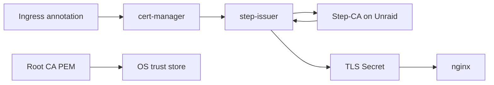

# Step-CA (internal TLS)

Let's Encrypt cannot issue a certificate for `grafana.k8s.home.example.com`. Their validators are on the internet; that name is not. You need a **private CA** that your laptops and phones trust.

This starter uses [Step-CA](https://smallstep.com/docs/step-ca/) **on Unraid** (or any always-on host) plus [step-issuer](https://github.com/smallstep/step-issuer) in the cluster. cert-manager asks the issuer; the issuer asks Step-CA; nginx presents the cert.



Do **not** run Step-CA inside the same cluster as the only copy of the CA. If the cluster is down, you cannot mint or renew, and you have made restore harder. The NAS (or a small VM) is the right place.

## What you get

- Browser padlock on LAN names after you install **one** root certificate on each device.
- Short-lived leaf certs (this lab uses **24 hours**, renew at 8 hours). cert-manager keeps them fresh; a stolen key ages out.
- The same issuer for Ingresses **and** for a `Certificate` you push to Unraid's own web UI later.

What you do **not** get: public trust. Friends on LTE will not trust `*.k8s.home.example.com` unless they install your root. That is the point.

## Name constraints

When you `step ca init`, the CA's DNS names and provisioner passwords are yours. Issue only for names you own on the LAN:

- `*.k8s.home.example.com` (cluster UIs)
- optionally `*.home.example.com` and a couple of IPs (NAS, router)

If you later want a public name, use the Let's Encrypt ClusterIssuer. Do not point Step-CA at `example.com` just because you can.

## Install Step-CA on Unraid

Official image: `smallstep/step-ca`. Persist `/home/step` (or the image's `$STEPPATH`) on a share, e.g. `/mnt/user/appdata/step-ca`.

Publish **9005/tcp** on the Unraid LAN IP (the examples use `https://192.168.1.2:9005`). HTTP on that port is the CA API, not a website.

First boot, on a shell that has the `step` CLI (workstation or the container):

```bash
step ca init \
  --deployment-type standalone \
  --name "Home Lab CA" \
  --dns ca.home.example.com \
  --dns 192.168.1.2 \
  --address :9005 \
  --provisioner step-issuer \
  --password-file <(printf '%s' 'CHANGE-ME-AND-SEAL-LATER')
```

`--provisioner step-issuer` creates a **JWK provisioner** named `step-issuer`. That is what step-issuer uses. You can add an ACME provisioner later for certbot-style tools; the Kubernetes issuer does not need ACME.

Set max leaf lifetime to 24h (matches this lab's `Certificate` objects). In `ca.json` (`$(step path)/config/ca.json`):

```json
"authority": {
  "claims": {
    "minTLSCertDuration": "5m",
    "maxTLSCertDuration": "24h",
    "defaultTLSCertDuration": "24h"
  }
}
```

Restart the container after editing. Keep the **root** and **intermediate** keys on the Unraid volume. Back that volume up like you would etcd.

### Values you will paste into Git (not secrets)

```bash
# kid for the JWK provisioner
step ca provisioner list --ca-url https://192.168.1.2:9005 --root $(step path)/certs/root_ca.crt

# caBundle: root PEM, single-line base64
base64 -w0 < "$(step path)/certs/root_ca.crt"; echo
```

`provisioner.kid` is a string on the JWK provisioner (looks like a long hash). `provisioner.name` must match the init name (`step-issuer`).

`caBundle` in `values/step-issuer/manifests/issuer.yaml` is that base64. It is **not** a secret in the TLS sense (it is the public root), but treat the **provisioner password** as a secret.

### Provisioner password

```bash
kubectl -n step-issuer create secret generic step-issuer-provisioner-password \
  --from-literal=password='the-password-from-init' \
  --dry-run=client -o yaml \
  | kubeseal --format=yaml --cert=pub-cert.pem \
  > values/step-issuer/manifests/sealed-secret-provisioner.yaml
```

Add the file to `values/step-issuer/manifests/kustomization.yaml`. Wave 1 must be Healthy first.

## step-issuer in the cluster (wave 4)

The Helm chart installs the controller. The `StepClusterIssuer` is cluster-scoped:

```yaml
apiVersion: certmanager.step.sm/v1beta1
kind: StepClusterIssuer
metadata:
  name: step-issuer
spec:
  url: https://192.168.1.2:9005
  caBundle: CHANGEME_BASE64_CA_PEM
  provisioner:
    name: step-issuer
    kid: CHANGEME
    passwordRef:
      name: step-issuer-provisioner-password
      key: password
      namespace: step-issuer
```

The controller must reach `url` from **inside** the cluster (pod → Unraid:9005). If Unraid firewalls that port, only the LAN browser test will work and Certificates will stay `Issuing`.

### Ingress annotations (this is the footgun)

`cert-manager.io/cluster-issuer: step-issuer` talks to a cert-manager `ClusterIssuer`. **StepClusterIssuer is a different kind.** Use:

```yaml
metadata:
  annotations:
    cert-manager.io/issuer: step-issuer
    cert-manager.io/issuer-kind: StepClusterIssuer
    cert-manager.io/issuer-group: certmanager.step.sm
spec:
  ingressClassName: nginx
  tls:
    - hosts: ["grafana.k8s.home.example.com"]
      secretName: grafana-tls
  rules:
    - host: grafana.k8s.home.example.com
      http:
        paths:
          - path: /
            pathType: Prefix
            backend:
              service:
                name: kube-prometheus-stack-grafana
                port:
                  number: 80
```

For public names, keep `cert-manager.io/cluster-issuer: letsencrypt` and a hostname in the public zone.

### Standalone Certificate (NAS, IP SANs)

Ingress annotations only cover HTTP names on nginx. Unraid's own UI, or a cert with an IP SAN, needs a `Certificate`:

```yaml
apiVersion: cert-manager.io/v1
kind: Certificate
metadata:
  name: unraid-server
  namespace: step-issuer
spec:
  secretName: unraid-server-tls
  duration: 24h
  renewBefore: 8h
  commonName: unraid.home.example.com
  dnsNames:
    - unraid.home.example.com
  ipAddresses:
    - 192.168.1.2
  issuerRef:
    name: step-issuer
    kind: StepClusterIssuer
    group: certmanager.step.sm
```

`duration: 24h` will fail if `ca.json` still has a 24h **max** and you ask for 25h. Keep them aligned. Getting the PEM onto Unraid's nginx is a separate copy/reload job; this starter does not ship that.

## Trust the root on clients

Until the root is in the **OS** trust store, every browser will warn. Firefox on Linux uses its own store unless you tell it not to.

**Root file:** `$(step path)/certs/root_ca.crt` on the CA host. Distribute that file (it is public). Never distribute `root_ca_key`.

=== "Linux (Fedora / Arch / Debian)"

    ```bash
    sudo trust anchor --store root_ca.crt
    # or
    sudo cp root_ca.crt /usr/local/share/ca-certificates/home-lab-ca.crt
    sudo update-ca-certificates
    ```

=== "macOS"

    Keychain Access → System → Certificates → import `root_ca.crt` → **Always Trust** for SSL.

=== "Windows"

    `certutil -addstore -f ROOT root_ca.crt` (admin), or mmc Certificates snap-in → Trusted Root Certification Authorities.

=== "iOS / Android"

    Install the profile / CA cert and enable full trust for it (iOS: Settings → General → About → Certificate Trust Settings). Phones that never visit LAN UIs can skip this.

=== "Firefox"

    Settings → Certificates → View → Authorities → Import. Or set `security.enterprise_roots.enabled` so Firefox uses the OS store.

`curl -v https://grafana.k8s.home.example.com` on a machine with the root installed should show a chain to Home Lab CA and HTTP 200/302, not `self signed certificate`.

## End-to-end: first internal UI

1. [DNS](dns.md): `dig grafana.k8s.home.example.com` from the laptop returns the ingress VIP.
2. Step-CA is up: `curl -vk https://192.168.1.2:9005/health` (or the CA's health URL).
3. Wave 2 (cert-manager) and wave 4 (step-issuer) are Healthy. `StepClusterIssuer` shows Ready.
4. Ingress exists with the annotations above. `kubectl get certificate,certificaterequest,order -A` (orders are ACME-only; for Step you care about Certificate + CertificateRequest).
5. `kubectl get secret grafana-tls -n monitoring -o jsonpath='{.data.tls\.crt}' | base64 -d | openssl x509 -noout -issuer -dates -ext subjectAltName`
6. Browser with the root installed: `https://grafana.k8s.home.example.com`.

If the Certificate is Ready but the browser still warns, you are missing the **root** on that device, or you are hitting the VIP by IP (no SAN match).

## Skip Step-CA

Delete `applications/step-issuer.yaml`. Use only Let's Encrypt on public names, or live with browser warnings / mkcert on a single admin laptop. mkcert is fine for one person and a pain the first time a second laptop appears.

## Checklist

1. CA data dir on Unraid is backed up.
2. `maxTLSCertDuration` is 24h.
3. `issuer.yaml` has real `url`, `caBundle`, `kid`, `name`.
4. Provisioner password is a SealedSecret, not plaintext.
5. Pods can route to Unraid:9005.
6. Ingresses use `issuer` + `issuer-kind: StepClusterIssuer` + `issuer-group: certmanager.step.sm`.
7. Root is installed on the devices you actually use.
8. Public names still use `letsencrypt`, not this issuer.
